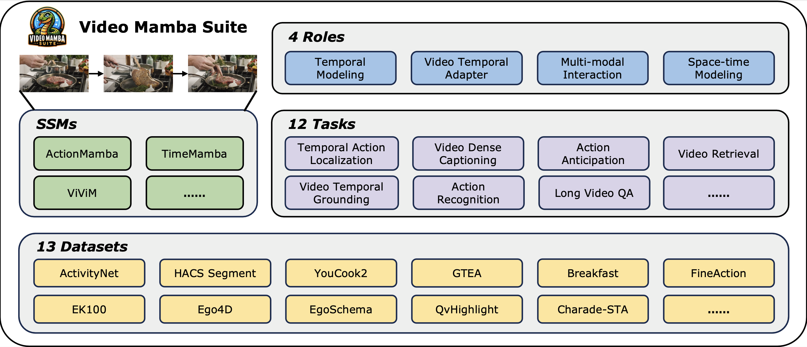

<div align="center">

<h2></img><a href="https://arxiv.org/abs/2403.09626">Video Mamba Suite: State Space Model as a Versatile Alternative for Video Understanding</a></h2>

[Guo Chen](https://scholar.google.com/citations?user=lRj3moAAAAAJ), [Yifei Huang](https://scholar.google.com/citations?user=RU8gNcgAAAAJ), [Jilan Xu](https://scholar.google.com/citations?user=mf2U64IAAAAJ), [Baoqi Pei](), [Zhe Chen](https://scholar.google.com/citations?user=j1rq_lYAAAAJ), [Zhiqi Li](https://scholar.google.com/citations?user=H2fJLqEAAAAJ), [Jihao Wang](), [Kunchang Li](https://scholar.google.com/citations?user=D4tLSbsAAAAJ), [Tong Lu]() and [Limin Wang](https://scholar.google.com/citations?user=HEuN8PcAAAAJ).

</div>


## Introduction

Understanding videos is one of the fundamental directions in computer vision research, with extensive efforts dedicated to exploring various architectures such as RNN, 3D CNN, and Transformers.
The newly proposed architecture of state space model, e.g, Mamba, shows promising traits to extend its success in long sequence modeling to video modeling. 
To assess whether Mamba can be a viable alternative to Transformers in the video understanding domain, in this work, we conduct a comprehensive set of studies, probing different roles Mamba can play in modeling videos, while investigating diverse tasks where Mamba could exhibit superiority. 
We categorize Mamba into four roles for modeling videos, deriving a **Video Mamba Suite** composed of 14 models/modules, and evaluating them on 12 video understanding tasks. Our extensive experiments reveal the strong potential of Mamba on both video-only and video-language tasks while showing promising efficiency-performance trade-offs.
We hope this work could provide valuable data points and insights for future research on video understanding.


## 📢 NOTICE
**The code is being sorted out and will be released gradually in the next few days.**

## 📢 News


(2024/03/15) 🔄The repository is public.

(2024/03/12) 🔄The repository is created.


### Mamba for Video Temporal Modeling

#### Supported tasks:
[Temporal Action Localization]()

[Temporal Action Segmentation]()

[Video dense captioning]()

[Video paragraph captioning]()

[Action Anticipation]()


### Mamba for Cross-modal Interaction

Supported tasks:

[Video Temporal Grounding]()

[Highlight Detection]()


### Mamba as Video Temporal Adapter

Supported tasks:

[Multi-instance Retrieval]()

[Action Recognition]()

[Long-form Video Question-Answer]()


### Mamba for Spatial-temporal Modeling

Supported tasks:

[Multi-instance Retrieval]()

[Action Recognition]()

[Long-form Video Question-Answer]()


### Related dataset resources:

[THUMOS-14]()

[ActivityNet]()

[HACS Segment]()

[FineAction]()

[GTEA]()

[YouCook2]()

[Breakfast]()

[FineAction]()

[Epic-kitchen-100]()

[Ego4D]()

[EgoSchema]()

[QvHighlight]()

[Charade-STA]()


## Cite

If you find this repository useful, please use the following BibTeX entry for citation.

```latex
@misc{2024videomambasuite,
      title={Video Mamba Suite: State Space Model as a Versatile Alternative for Video Understanding}, 
      author={Guo Chen, Yifei Huang, Jilan Xu, Baoqi Pei, Zhe Chen, Zhiqi Li, Jiahao Wang, Kunchang Li, Tong Lu, Limin Wang},
      year={2024},
      eprint={2403.09626},
      archivePrefix={arXiv},
      primaryClass={cs.CV}
}
```


## License

This project is released under the [MIT License](./LICENSE)

## Acknowledgement

This repository is built based on [ActionFormer](https://github.com/happyharrycn/actionformer_release), [UniVTG](https://github.com/showlab/UniVTG), [ASFormer](https://github.com/ChinaYi/ASFormer), [PDVC](https://github.com/ttengwang/PDVC), [Testra](https://github.com/zhaoyue-zephyrus/TeSTra), [MAT](https://github.com/Echo0125/Memory-and-Anticipation-Transformer), [AVION](https://github.com/zhaoyue-zephyrus/AVION), [InternVideo](https://github.com/OpenGVLab/InternVideo), [EgoSchema](https://github.com/egoschema/EgoSchema), [ViM](https://github.com/hustvl/Vim) and [Mamba](https://github.com/state-spaces/mamba) repository.
